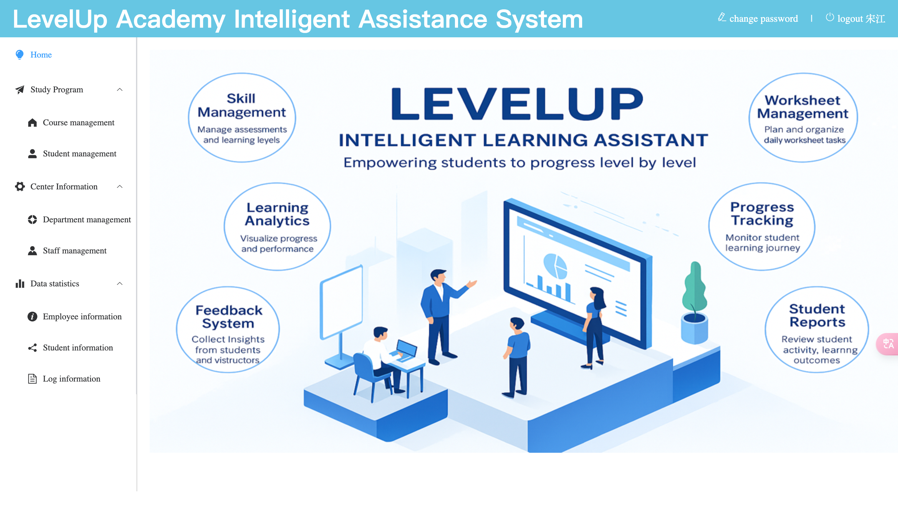
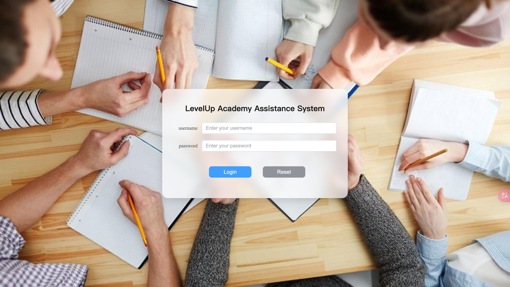
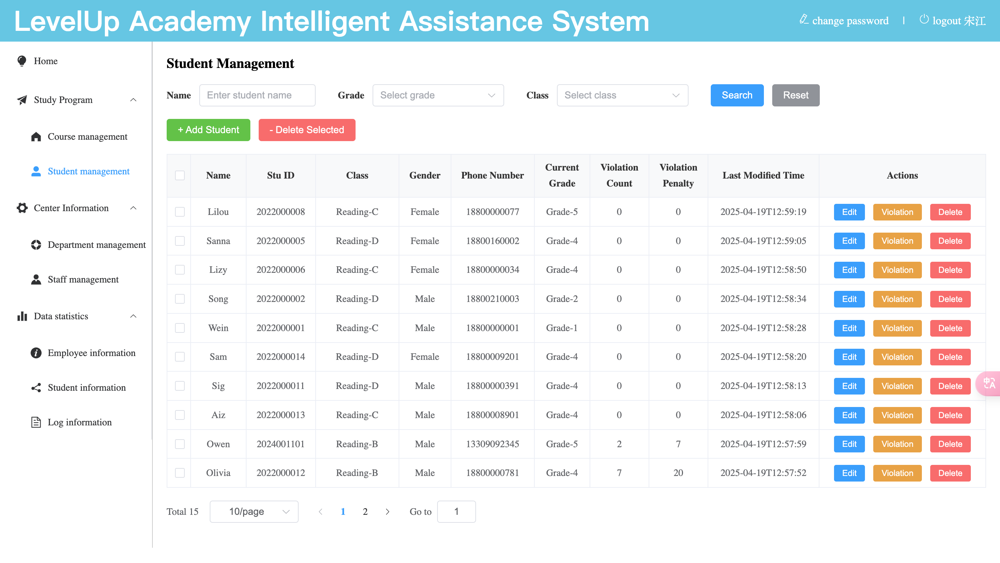
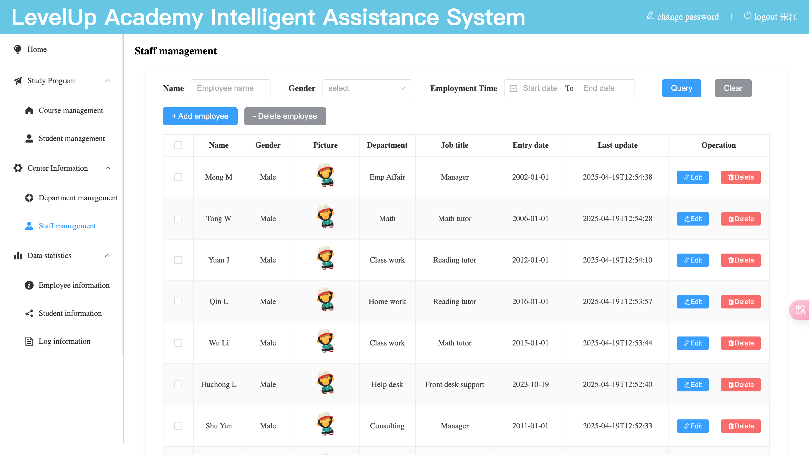
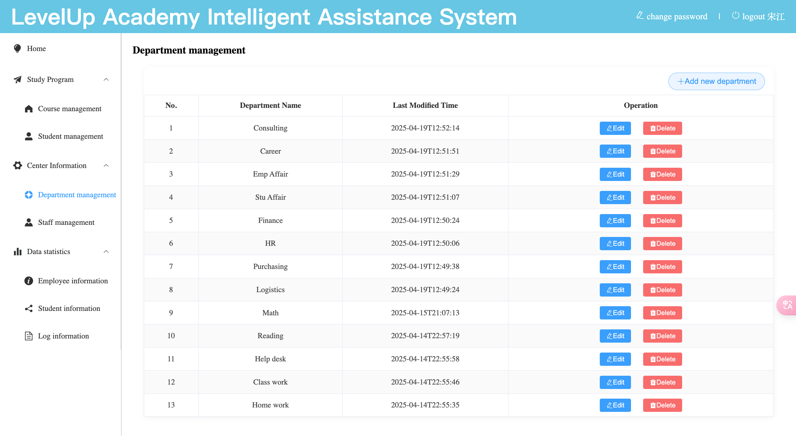
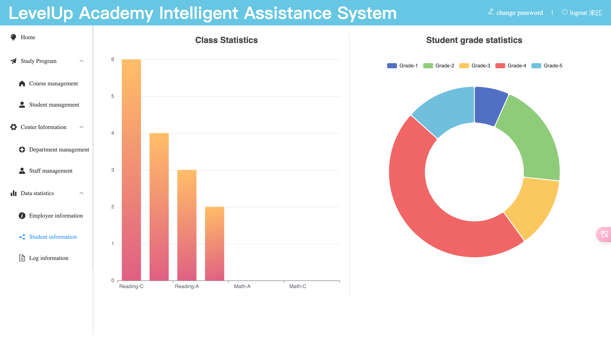

# 🚀 LevelUP Academic System

**LevelUP Academic System** is a full-stack web application designed for educational purposes. It demonstrates modern web development practices by integrating frontend, backend, database, and deployment technologies into a complete system.

This project was built while following a structured learning path and is suitable for students or developers who want to understand how to create a complete web application from scratch and deploy it in a real-world environment.

## 🏠 Home Page



---

## ✨ Features

- 🔐 User authentication (login/logout)  
- 🧑‍🎓 Student management (add/edit/delete/search)  
- 🏫 Class management  
- 🛡️ Role-based access control  
- 🎨 Responsive UI using Element Plus  
- 🔗 RESTful API with Spring Boot backend  
- 💾 Persistent data storage using MySQL  
- 📦 Deployment-ready with Docker  

---

## 🛠️ Tech Stack

### 💻 Frontend

- 🧱 HTML5, CSS3, JavaScript (ES6+)
- ⚙️ Vue 3
- 🧩 Element Plus (UI component library)
- 🔁 Axios (for HTTP requests)
- 🧭 Vue Router
- 🛠️ Vue CLI

### 🧠 Backend

- ☕ Java 17+
- 🌱 Spring Boot
- 📦 Maven
- 🐬 MySQL
- 🔌 JDBC
- 🧬 MyBatis

### 🚀 DevOps & Deployment

- 🐧 Linux
- 🐳 Docker
- ⚙️ Docker Compose

---

## 🚀 Getting Started

### ✅ Prerequisites

- 🟩 Node.js (>=16.x)
- ☕ Java JDK (>=17)
- 📦 Maven (>=3.6)
- 🐬 MySQL (>=8.0)
- 🐳 Docker (optional for deployment)
  
### Frontend Setup
- bash
- Copy
- Edit
- cd frontend
- npm install
- npm run dev

### Backend Setup
- bash
- Copy
- Edit
- cd backend
- mvn clean package
- java -jar target/levelup-academic-system.jar
- Replace the JAR name with your actual build artifact.

### Docker Deployment (Optional)
- bash
- Copy
- Edit
- cd docker
- docker-compose up -d
- Database Configuration
- Before running the backend, make sure to:

Create a MySQL database (e.g., levelup_db)

Update the database URL, username, and password in application.yml

Execute the schema.sql (if provided) to initialize tables

### 📘 Learning Path Covered
This project follows a structured learning journey:

🌐 Frontend Fundamentals: HTML, CSS, JavaScript, Vue 3, Axios

🧱 Backend Fundamentals: Maven, JDBC, MySQL, MyBatis, REST APIs

⚙️ Backend Practice: Case-based development (Tlias project)

🎨 Frontend Practice: Vue modularization, ElementPlus integration

🚀 Project Deployment: Linux, Docker, Nginx (optional)


## 📸 Screenshots

🔐 Login Page


🧑‍🎓 Student Management


🧑‍🏫 Staff Management


📚 Class Management


🏫 Department Management


📈 Student Info


## 👤 Author
Developed by Shu
🎓 Course Project based on 黑马程序员 curriculum.

## 🧾 Project Structure

```bash
LevelUP-Academic-System/
├── frontend/               # Vue 3 + ElementPlus project
│   ├── public/             
│   ├── src/
│   │   ├── assets/
│   │   ├── components/
│   │   ├── router/
│   │   ├── views/
│   │   └── App.vue
│   ├── package.json
│   └── vite.config.js
│
├── backend/                # Spring Boot backend project
│   ├── src/
│   │   ├── main/
│   │   │   ├── java/com/example/
│   │   │   ├── resources/
│   ├── pom.xml
│   └── application.yml
│
├── docker/                 # Dockerfiles and deployment configuration
│   ├── Dockerfile-backend
│   ├── Dockerfile-frontend
│   └── docker-compose.yml
│
└── README.md


